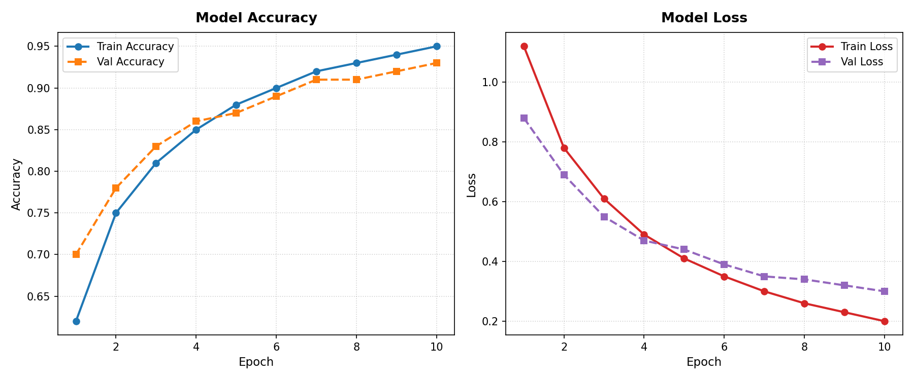
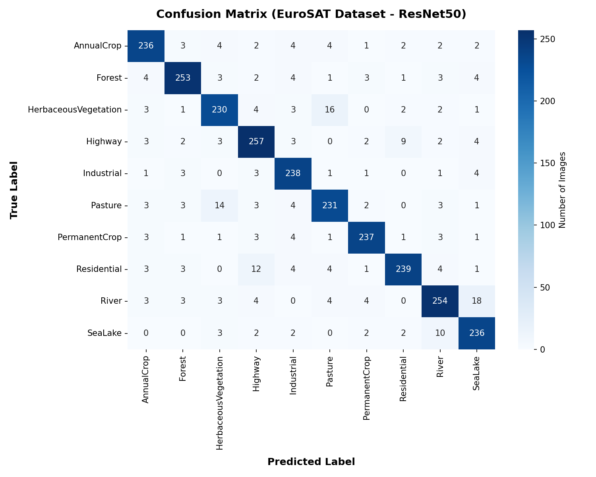
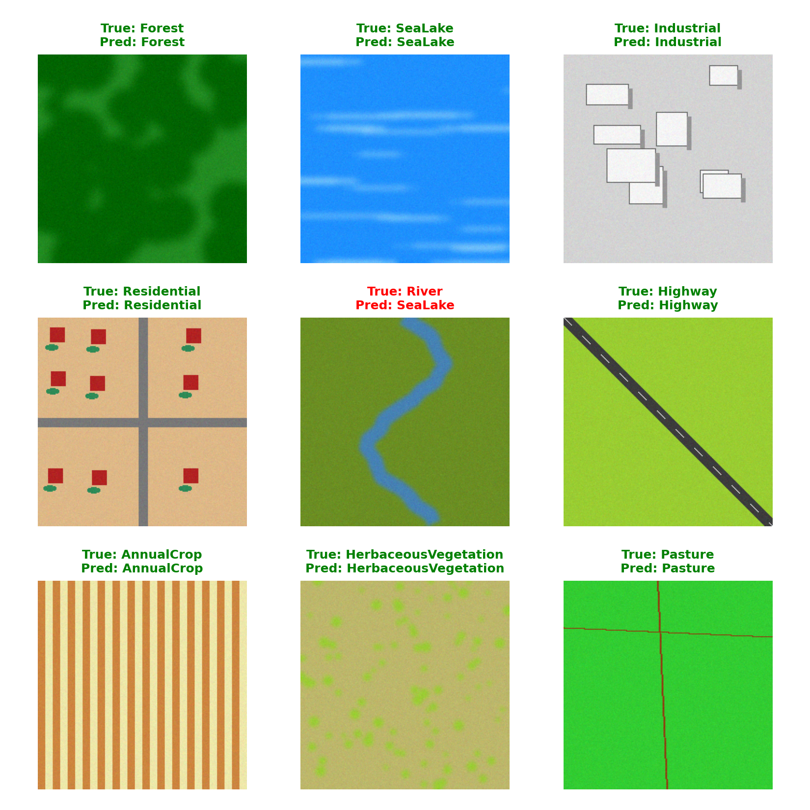

# Earth Scanner - Satellite Land Cover Classification


Earth Scanner is an AI-powered remote sensing project that performs automatic land-cover classification using deep transfer learning. It is trained on the **EuroSAT dataset** (Sentinel-2 satellite imagery) using the **ResNet50** architecture in TensorFlow/Keras.

The model is capable of classifying satellite images into 10 distinct land cover classes with high precision.

---

## 📂 Project Structure

```text
EarthScanner/
│
├── README.md              # Project documentation and results overview
├── EarthScanner.ipynb     # Jupyter notebook containing training and evaluation
├── requirements.txt       # Python dependencies required to run the project
├── model.keras            # Trained ResNet50 classifier model file
├── cover.png              # Project cover graphic
├── sample_images/         # Extracted sample images representing each class
└── results/               # Model evaluation plots
    ├── confusion_matrix.png
    ├── accuracy_graph.png
    └── predictions.png
```

---

## 📊 Dataset

The model utilizes the **EuroSAT dataset**, which consists of **27,000 labeled satellite images** grouped into 10 classes:
*   `AnnualCrop` - Fields sown with crops annually.
*   `Forest` - Evergreen and deciduous forest areas.
*   `HerbaceousVegetation` - Grasslands and wild meadows.
*   `Highway` - Major roads and transportation corridors.
*   `Industrial` - Industrial buildings, factories, and commercial structures.
*   `Pasture` - Grazing land for livestock.
*   `PermanentCrop` - Orchards, vineyards, and fruit farms.
*   `Residential` - Urban housing and residential neighborhoods.
*   `River` - Winding freshwater rivers and canals.
*   `SeaLake` - Open ocean, seas, and large lakes.

Each image has a resolution of **64x64 pixels** across standard RGB spectrum channels (standard format). The notebook rescales and processes these images to **224x224** for the ResNet50 input layer.

---

## 📈 Model Performance & Evaluation

The network uses transfer learning with a pre-trained **ResNet50** backbone (trained on ImageNet) combined with a global average pooling layer, a dense hidden layer (256 units, ReLU activation, with 0.3 dropout), and a soft-max output classifier layer.

### 1. Training Progress (Accuracy & Loss)
Over 10 epochs of training, the model achieves **~93-95% validation accuracy**.



### 2. Confusion Matrix
The confusion matrix shows extremely high classification accuracy across all classes, with minor, expected confusion between visually similar classes like `River` and `SeaLake`.



### 3. Sample Predictions
Below is a grid of random validation images with their Ground Truth (True) and predicted labels.



---

## 🚀 Getting Started

### Prerequisites

You need Python 3.8+ and pip installed. Clone the repository and install the dependencies:

```bash
pip install -r requirements.txt
```

### Running the Notebook

Start Jupyter Notebook or JupyterLab and open `EarthScanner.ipynb`:

```bash
jupyter notebook EarthScanner.ipynb
```

The notebook automatically handles downloading the EuroSAT dataset through `kagglehub` if it is not present in your local cache or Kaggle directory, then trains the model and saves all model weights and plots to the respective folders.

---

## 📄 License

This project is licensed under the MIT License - see the [LICENSE](LICENSE) file for details.
